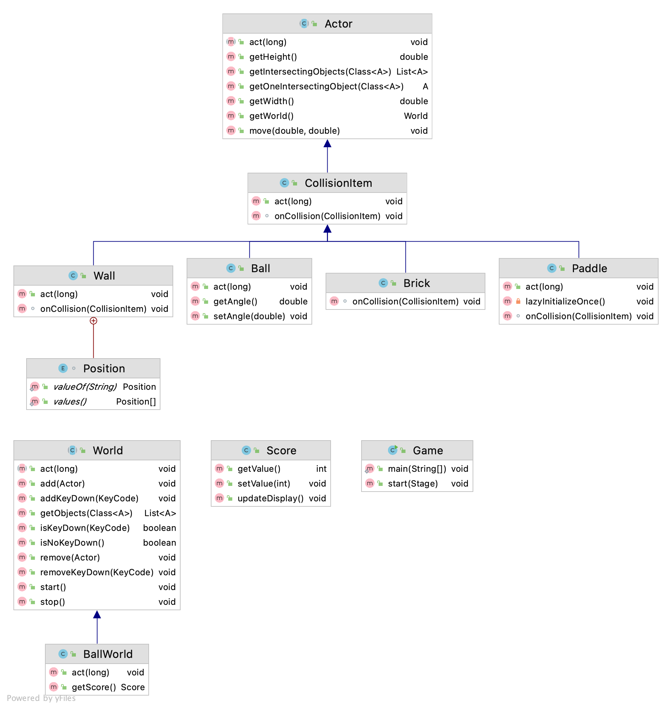

## Objectives

Learning Java and object oriented programming by implementing a reasonably complex project to get a better understanding of the following concepts:

* Setting up a Java project and development environment with multiple source and resource files
* Object oriented programming with better code reuse via extensibility
* Graphical user interface and learning the JavaFx framework
* Applying basic physics in game programming
* Basics of event based and multi-threaded programming
* Debugging and troubleshooting a program
* Bitbucket (Github) hosted git to track development workflow through pull requests and code reviews

## Game Idea

I would like to first get a basic Breakout game with precise rebound on collision before expanding.

- The first iteration of the game would be to make the walls react on collision
- Once that happens, I would like to add hidden portals from which additional powers will shower down for the player to catch
- It will be hard to catch them and still ensure the ball does not reach the bottom
- If it becomes too hard to play, I will allow a fixed number of times the ball can strike the bottom before exploding and ending the game

I have seen Galaga game (https://apps.apple.com/us/app/galaga-wars/id107395947) and would like to eventually expand the game with more features

## Game progress

Building a stable foundation took a lot of time. Following are some of the challenges I encountered and solved.

- Removing brick on collision with ball would throw an exception. After debugging, I found that it was due to removing entry from game world when iterating the list of objects in the world
- Collision of ball with walls would lead to occasional infinite rebound. This is mostly avoided by preventing repeat collisions of ball with any object by keeping track of previously collided items in a set
- Ball would sometimes bounce multiple times on the paddle. This was fixed by avoiding repeat collisions with same object
- Simulating explosion by resizing an exploding image till it disappears required using TimeLine
- Added sound effects on collision. This causes a short stutter/freeze the first time. I tried different approaches by playing the same sound when game starts but did not help. Would like to eventually solve this problem and use more audio effects like a typical arcade game
- Implemented game rules to gain points or lose points leading to eventual result - win or lose

## Future plans

With a fairly stable game engine, I would like to add additional levels of difficulty like moving bricks making it harder to strike with ball, falling bricks that can hit the paddle and remove points and ability for paddle to become a spaceship and shoot falling bricks. 

Eventually, this can transform into a spaceship and shooter game like **Galaga** (as originally intended)

## Class Diagrams

